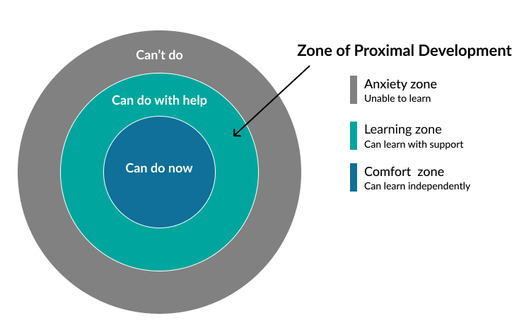

class: middle, center

<!-- this file is written for remark: https://github.com/gnab/remark/wiki -->

# Test-Driven Development with Large Language Models

## _TDD with LLMs_

 

---

class: middle, center

## Knowledge Sharing: _Slido_

---

class: middle

## Agenda

- **Learning Objectives**

- **Zone of Proximal Development (_ZPD_)**

- **Test-Driven Development (_TDD_)**

- **Large Language Models (_LLMs_)**

- **TDD with LLMs**

- **The Workflow**

- **Breakout Groups: _./exercises_**

- **Discussion + Q&A**

---

class: middle

## Learning Objectives

- You can use the ZPD model to choose which challenges to study

- You understand the value of writing tests _before_ writing code

- You can explain the TDD cycle and are ready to practice it on your own

- You understand that LLMs do not replace good development habits

- You understand how to integrate LLMs in your workflows
  - Not as _replacements_ for good workflows

- You can tell when a coding challenge is distractingly difficult for you right now
  - Focus on your _development workflows_, not solving hard problems!

- For self-study: _[objectives in the README](./README.md#learning-objectives)_

---

class: middle, center

## Zone of Proximal Development (_ZPD_)

---

class: middle

## ZPD: _study advice_

- You have of two separate ZPDs as you learn to program
  - The **difficulty of challenges** you solve
  - The **development process** you use to solve challenges

- Focus on your  **development process**, not hard challenges
  - Repeat the _entire process_ with _good practices_ and easy challenges
  - Not fewer times with harder challenges with bad practices

- Focus on coding challenges in your _can do now_ zone

---

class: middle, center

## Test-Driven Development (_TDD_)

---

class: middle

## TDD: _write tests first?!_

- Be sure you understand the function's _behavior_

- Be confident your function behaves correctly

- Unit tests are easier to write than functions!

- Pace your development -> move slowly with confidence
  - Spend time up front, save time later

- You probably won't write tests _after_ your function works

---

class: middle

## TDD: _incremental development_

- Break the whole problem into smaller, simpler _behaviors_

- Solve one small _behavior_ at a time

- Improve your _strategy_ and _implementation_ before adding new _behaviors_

---

class: middle

## Large Language Models (_LLMs_)

_This workshop is not about how LLMs work, how to develop them, or their risks._

 

- You _are not_ required to use them for Foundations
  - but we know most of you probably will

- Think of them as _collaborators_, not _replacements_

- LLMs can generate code, but they cannot understand the code for you

- LLMs can make mistakes, it's your responsibility to catch them

- LLMs are not free!
  - Many require accounts, full access requires paid accounts
  - They use _a lot_ of electricity and resources

---

class: middle

## TDD with LLMs

_TDD does not change! LLMs just help with some steps:_

- You still need to understand the behavior

- You still need to check and run your tests

- You still need to step through and understand the function

- You still need to decide if the strategy is overly complicated

- You still need to decide if the implementation is clear

- You still need to do code review with a checklist

- The LLM only speeds up the bits where you write code

---

class: middle, center

## ~~Breakout Groups: `./exercises`~~

## Live Demo: _TDD without LLMs_

---

class: middle, center

## Discussion + Q & A

---

class: middle, center

# Thank You

 

---
